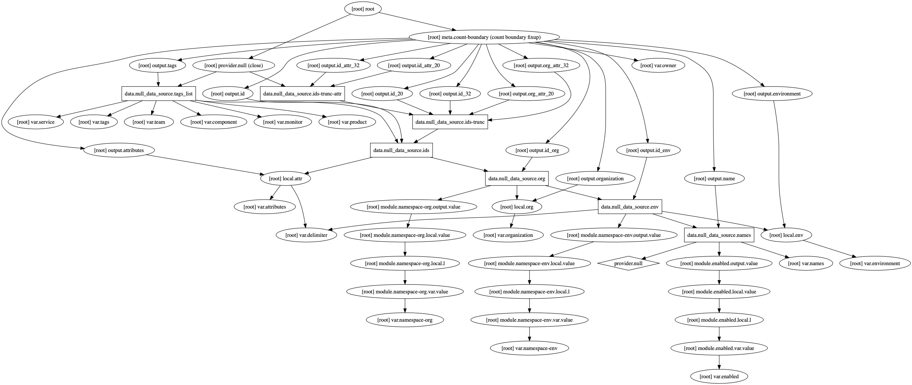

# terraform-null-labels

[](https://circleci.com/gh/appzen-oss/terraform-null-labels)
[](https://github.com/appzen-oss/terraform-null-labels/releases)

Terraform module to provide consistent label names and tags for resources.

This is similar to [label](https://registry.terraform.io/modules/devops-workflow/label/local) except:

- This accepts a list of names, instead of a string. And returns lists.
- This uses null-resource instead of locals. This was required to be able to use count.

The goal is to keep [label](https://registry.terraform.io/modules/devops-workflow/label/local)
and [labels](https://registry.terraform.io/modules/devops-workflow/labels/null)
in sync and update both at the same time for any changes.
Where this is possible.

A single name format will not solve every use case, so multiple variants are
returned and there is a few options to affect how they get build. The general
name convention is `[organization]-[environment]-[name]-[attributes]`. `Name`
is required, the other 3 can be turned on/off individually. The delimiter
(`-`) can be changed

All [devops-workflow](https://registry.terraform.io/modules/devops-workflow)
modules will eventually use this or [label](https://registry.terraform.io/modules/devops-workflow/label/local).

**NOTE:** `null` refers to this using [null_resource](https://www.terraform.io/docs/providers/null/index.html)

[Terraform registry](https://registry.terraform.io/modules/devops-workflow/labels/null)

## Usage

### Basic Example

```hcl
module "names" {
  source        = "devops-workflow/labels/null"
  version       = "0.0.1"
  names         = ["name1", "name2"]
  environment   = "qa"
}
```

This will create 2 `id` with the values of `qa-name1` and `qa-name2`

### S3 Example

```hcl
variable "names" {
  default = ["data1", "data2"]
}

module "s3-name" {
  source        = "devops-workflow/labels/null"
  version       = "0.0.1"
  names         = "${var.names}"
  environment   = "qa"
  organization  = "corp"
  namespace-org = "true"
}
```

This will create 2 `id` with the values of `corp-qa-data1` and `corp-qa-data2`

Now reference `labels` outputs to create the S3 buckets

```hcl
resource "aws_s3_bucket" "data" {
  count   = "${length(var.names)}"
  bucket  = "${element(module.s3-name.id, count.index)}"
}
```

### All Variables Example

Using in a module and exposing all settings to upstream caller.

```hcl
module "labels" {
  source        = "devops-workflow/labels/null"
  version       = "0.0.1"
  organization  = "${var.organization}"
  names         = "${var.names}"
  namespace-env = "${var.namespace-env}"
  namespace-org = "${var.namespace-org}"
  environment   = "${var.environment}"
  delimiter     = "${var.delimiter}"
  attributes    = "${var.attributes}"
  tags          = "${var.tags}"
}
```

<!-- BEGINNING OF PRE-COMMIT-TERRAFORM DOCS HOOK -->
## Inputs

| Name | Description | Type | Default | Required |
|------|-------------|:----:|:-----:|:-----:|
| attributes | Suffix name with additional attributes (policy, role, etc.) | list | `<list>` | no |
| component | TAG: Underlying, dedicated piece of service (Cache, DB, ...) | string | `"UNDEF"` | no |
| delimiter | Delimiter to be used between `name`, `namespaces`, `attributes`, etc. | string | `"-"` | no |
| enabled | Set to false to prevent the module from creating anything | string | `"true"` | no |
| environment | Environment (ex: `dev`, `qa`, `stage`, `prod`). (Second or top level namespace. Depending on namespacing options) | string | n/a | yes |
| monitor | TAG: Should resource be monitored | string | `"UNDEF"` | no |
| names | Base names for resources | list | n/a | yes |
| namespace-env | Prefix name with the environment. If true, format is: [env]-[name] | string | `"true"` | no |
| namespace-org | Prefix name with the organization. If true, format is: [org]-[env namespaced name]. If both env and org namespaces are used, format will be [org]-[env]-[name] | string | `"false"` | no |
| organization | Organization name (Top level namespace) | string | `""` | no |
| owner | TAG: Owner of the service | string | `"UNDEF"` | no |
| product | TAG: Company/business product | string | `"UNDEF"` | no |
| service | TAG: Application (microservice) name | string | `"UNDEF"` | no |
| tags | A map of additional tags | map | `<map>` | no |
| team | TAG: Department/team of people responsible for service | string | `"UNDEF"` | no |

## Outputs

| Name | Description |
|------|-------------|
| attributes | Attribute string lowercase |
| environment | Environment name lowercase |
| id | Fully formatted name ID |
| id\_20 | ID truncated to 20 characters |
| id\_32 | ID truncated to 32 characters |
| id\_attr\_20 | ID max size 20 characters by truncating `id_org` then appending `attributes` |
| id\_attr\_32 | ID max size 32 characters by truncating `id_org` then appending `attributes` |
| id\_env | If env namespace enabled [env]-[name] else [name] |
| id\_org | If org namespace enabled [org]-[id_env] else [id_env] |
| name | Name lowercase |
| org\_attr\_20 | Internal debugging. DO NOT USE |
| org\_attr\_32 | Internal debugging. DO NOT USE |
| organization | Organization name lowercase |
| tags |  |

<!-- END OF PRE-COMMIT-TERRAFORM DOCS HOOK -->
<!-- BEGINNING OF PRE-COMMIT-TERRAFORM GRAPH HOOK -->

## Resource Graph of plan


<!-- END OF PRE-COMMIT-TERRAFORM GRAPH HOOK -->
